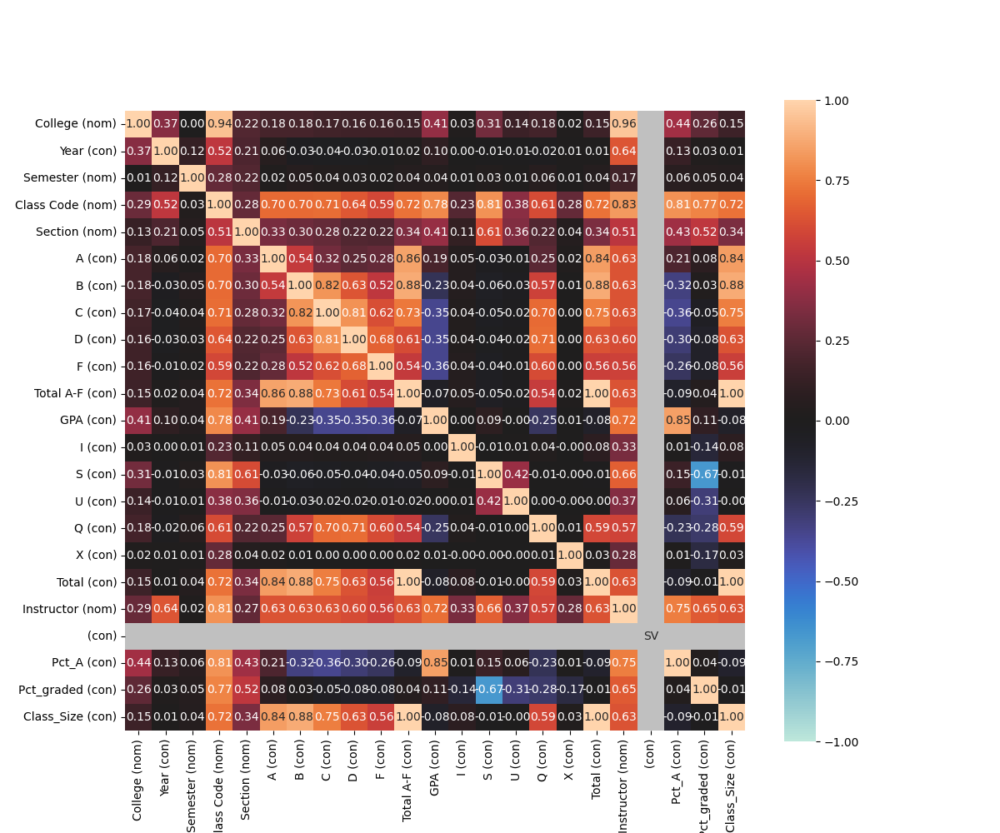

# TAMU Grade Consolidator v2.2

**A robust Python ETL + analytics pipeline for downloading, parsing, cleaning, storing, analyzing, and visualizing university transcript and grade data.**



## Overview

The **TAMU Grade Consolidator** is an end-to-end data pipeline that automates the extraction, transformation, and loading (ETL) of academic grade/transcript data from Texas A&M University (and similar institutions). 

It pulls raw data files, intelligently extracts metadata from filenames, standardizes and cleans the data, stores everything in a SQL database, runs correlation analysis, and generates professional visualizations (such as the association heatmap shown above).

This project showcases real-world **data engineering** and **exploratory data analysis (EDA)** skills — exactly the kind of work done daily in data science & analytics roles.

## Published Dashboard

- [TAMU Grade Report Dashboard](https://dbc-0b583d12-fb33.cloud.databricks.com/dashboardsv3/01f19b35bd9b17059249244e024b3b9e/published?o=7474657376343742) -- the original correlation/EDA dashboard
- [TAMU Major Difficulty & Course Optimizer](https://dbc-0b583d12-fb33.cloud.databricks.com/dashboardsv3/01f19b6f9cce102b92c0bd9f3961f2a9/published?o=7474657376343742) -- which majors are statistically hardest (GPA + fail/drop rate), plus Gurobi-optimal elective picks per major, built on 105K+ real grade records (2017-2025)

## Why This Project Matters
- Handles real student transcript data at scale
- Demonstrates a complete production-style analytics workflow
- Uses modular, maintainable code that is easy to extend
- Perfect example of **cleaning/preprocessing data**, **SQL integration**, **statistical analysis**, and **complex data visualization**

## Features

- Automated file downloading from URLs or local sources
- Smart filename parsing (extracts student IDs, terms, etc.)
- Data cleaning and standardization with pandas
- Persistent storage in a relational SQL database
- Statistical correlation analysis between academic variables
- Generation of insightful visualizations (correlation heatmaps)
- Fully configurable via `config.py`
- Command-line interface with argparse
- Web scraping of TAMU's official degree plans (catalog.tamu.edu), normalized into a tidy course-by-semester schema
- Major difficulty ranking by expected GPA, plus a composite GPA + fail-rate + drop-rate difficulty score
- Gurobi MILP optimizer that finds the GPA-optimal elective choices within each major's degree plan
- Automated export to Databricks (Parquet -> Delta tables) and a published Lakeview dashboard

## Tech Stack

- **Python** (100%)
- **pandas** – Data manipulation & analysis
- **SQL / sqlite3** – Database storage & querying
- **matplotlib / seaborn** – Professional data visualization
- **requests / BeautifulSoup** – File downloading & HTML scraping
- **pathlib & re** – File handling & regex parsing
- **Gurobi** – Mixed-integer optimization for course/elective selection
- **Databricks (Lakeview, Unity Catalog, SQL Warehouses)** – Delta Lake storage & published dashboards

## Project Structure
TAMU-Grade-Consolidator-2.2/
├── main.py                 # Main entry point – runs the full pipeline
├── config.py               # All configuration settings
├── download.py             # Downloads raw grade files
├── data_from_filename.py   # Extracts metadata from filenames
├── converter.py            # Cleans and converts data to standard format
├── sql_handler.py          # SQL database operations (init, insert, query)
├── correlation_finder.py   # Performs correlation analysis
├── degree_plan_scraper.py     # Downloads/caches TAMU catalog degree-plan pages
├── degree_plan_normalizer.py  # Parses degree-plan HTML into a tidy DataFrame
├── major_difficulty_ranker.py # Joins degree plans with grade history, ranks majors by expected GPA
├── difficulty_index.py        # Adds fail-rate/drop-rate composite difficulty scoring
├── course_optimizer.py        # Gurobi MILP: optimal elective picks per major
├── export_for_databricks.py   # Exports tables/analysis to partitioned Parquet
├── databricks/
│   └── major_difficulty_dashboard.sql  # SQL notebook: loads Parquet into Delta tables (serverless SQL warehouse only)
├── associations_heatmap.png # Example output visualization
├── .gitignore
└── README.md
text## How It Works (Step-by-Step)

1. **Download** – Fetches raw transcript/grade files
2. **Parse** – Extracts student IDs and metadata from filenames
3. **Convert & Clean** – Standardizes data into a clean pandas DataFrame
4. **Store** – Loads cleaned data into an SQLite database
5. **Analyze** – Finds statistically significant correlations
6. **Visualize** – Generates and saves a correlation heatmap

## Degree Plan Scraper (prototype)

`degree_plan_scraper.py` + `degree_plan_normalizer.py` scrape and normalize
TAMU's undergraduate catalog "Plan of Study Grid" (the recommended
Freshman Fall / Freshman Spring / ... schedule for a major) from
catalog.tamu.edu, which is built on the CourseLeaf CMS.

- Add majors to scrape via `DEGREE_PLAN_SOURCES` in `config.py` (major name →
  catalog degree-plan URL, e.g. `.../undergraduate/<college>/<department>/bs/`).
- Run `python degree_plan_normalizer.py` to fetch (with local HTML caching in
  `data/degree_plans/html/`), parse, and store results into
  `degree_plan_courses` / `degree_plan_footnotes` tables in the SQLite DB.
- Output rows are typed by `row_type`: `course`, `requirement_block` (e.g.
  "Science elective"), `choice_header`/`choice_option` ("Select one of the
  following:" blocks), `term_subtotal`, and `plan_total`.

**Known limitations:** some Engineering majors admit students through a
common first-year + Entry-to-a-Major process, so their catalog page may only
describe a shared first year rather than a full 4-year plan. Course titles
containing "or" (e.g. cross-listed sequences) may be misclassified as choice
options. Verify parsed output against the source page before relying on it.

## Major Difficulty Ranker (prototype)

`major_difficulty_ranker.py` joins the scraped degree-plan course lists with
historical course GPA data from `all_grade_distributions` (built by
`main.py`, split into Subject/Number from the "Class Code" column) to
estimate a credit-hour-weighted "expected GPA" per major, assuming a student
follows the catalog's default plan. Run it after `degree_plan_normalizer.py`
and after ingesting real grade PDFs via `main.py`.

Each major's `coverage_pct` reports what fraction of its required credit
hours were actually matched to historical grade data — treat rankings with
low coverage as unreliable. Validated against 105k+ real ingested grade rows
(2017-2025); note that a department's course subject code can change over
time (e.g. Psychology's `PSYC` became `PBSI`), so unmatched courses may need
an entry in `SUBJECT_ALIASES`.

## Course Optimizer (Gurobi)

`course_optimizer.py` uses Gurobi to solve, per major, which option in each
"Select one of the following" choice group maximizes expected GPA (subject
to picking exactly one per group, and not double-selecting a course that
appears in more than one group). This gives an `optimal_expected_gpa` to
compare against the ranker's `expected_gpa` baseline (which just averages
options) — the gap is the potential GPA uplift from choosing electives
strategically. Requires a Gurobi license (a free size-limited license works
for these small models).

## Difficulty Index (GPA + fail rate + drop rate)

`difficulty_index.py` extends the ranker with the other half of the original
idea: harder classes aren't just lower-GPA, they also have higher failure and
drop rates. Computes per-course `fail_rate` (F / graded students) and
`drop_rate` ((Q+X) / all enrolled) alongside GPA, rolls them up per major the
same credit-hour-weighted way as the ranker, then combines all three into a
z-scored, 0-100 `difficulty_score` (relative ranking within the major list,
not an absolute scale). Notably reorders the ranking vs. GPA alone --
Mathematics ranks hardest here despite not having the lowest GPA, because it
has the highest fail/drop rates.

## Publishing to Databricks

`export_for_databricks.py` writes the grade distributions, degree plans, and
both ranker/optimizer outputs to partitioned Parquet under `data/parquet/`.
Upload that folder to a Unity Catalog Volume (`databricks fs cp` /
`databricks-sdk` / drag-and-drop in the UI), then run
`databricks/major_difficulty_dashboard.sql` (a SQL notebook) to load it into
Delta tables via `read_files()`. This only requires a **serverless SQL
warehouse** -- no all-purpose cluster needed, which matters if you don't want
to provision billable compute.

Live setup for this repo: uploaded to `/Volumes/workspace/default/tamu_grades`,
loaded into `workspace.tamu_grades.*` Delta tables, and published as a
Lakeview dashboard ("TAMU Major Difficulty & Course Optimizer") with:
- KPI counters (grade records analyzed, students graded, distinct courses, year range)
- Expected GPA by major, and the GPA+fail-rate+drop-rate difficulty score
- Baseline-vs-Gurobi-optimal GPA comparison and the optimizer's selected electives
- Top 10 hardest/easiest individual courses (min. 200 students graded), as bar charts
- University-wide GPA trend by year (grade inflation check)

**Lakeview quirk found while building this:** the "table" widget type silently
failed to bind fields for aggregated (GROUP BY) query results in this
workspace -- it rendered fine for a flat, non-aggregated dataset
(`optimizer_selections`) but showed "Visualization has no fields selected"
for `hardest_courses`/`easiest_courses` no matter how the column spec was
adjusted. Bar/line/counter widgets were reliable throughout, so those two
ended up as bar charts instead of tables.

## Installation & Usage

### 1. Clone the repo
```bash
git clone https://github.com/ConnorOswalt/TAMU-Grade-Consolidator-2.2.git
cd TAMU-Grade-Consolidator-2.2
2. Install dependencies
Bashpip install pandas matplotlib seaborn requests beautifulsoup4
3. (Optional) Update config.py
Edit database path, download directory, etc.
4. Run the full pipeline
Bashpython main.py
Optional flags (extendable):
Bashpython main.py --download   # Only run the download step
The script will automatically:

Download and process new data
Update the database
Generate a fresh associations_heatmap.png

Example Output
The pipeline produces a correlation heatmap that highlights relationships between different academic performance indicators (GPA, credit hours, course difficulty, etc.). This kind of insight is directly transferable to analyzing sensor data, yield predictions, or equipment performance in precision agriculture.
Skills Demonstrated

End-to-end data pipelines (ETL)
Data cleaning & preprocessing
Relational database design & management (SQL)
Statistical analysis & insight extraction
Complex data visualization
Clean, modular, and well-documented Python code
Real-world application of pandas, SQL, and visualization libraries
Web scraping & HTML parsing (BeautifulSoup)
Mathematical/combinatorial optimization (Gurobi MILP)
Cloud data platform integration (Databricks: Delta Lake, Unity Catalog, Lakeview dashboards)


Built by Connor Oswalt
Perfect for demonstrating Python + SQL + analytics skills in data science, analytics, or intelligent systems roles (especially those involving IoT/sensor data or agricultural machinery).
Star ⭐ the repo if you find it useful!